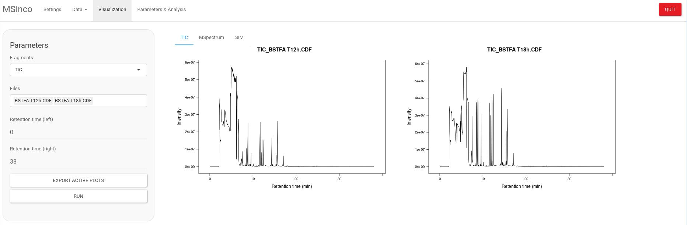
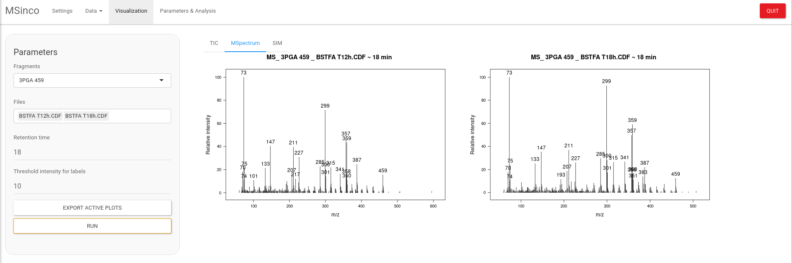
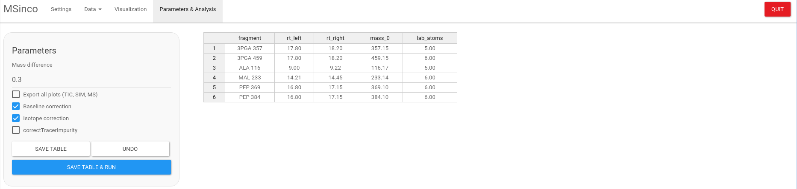
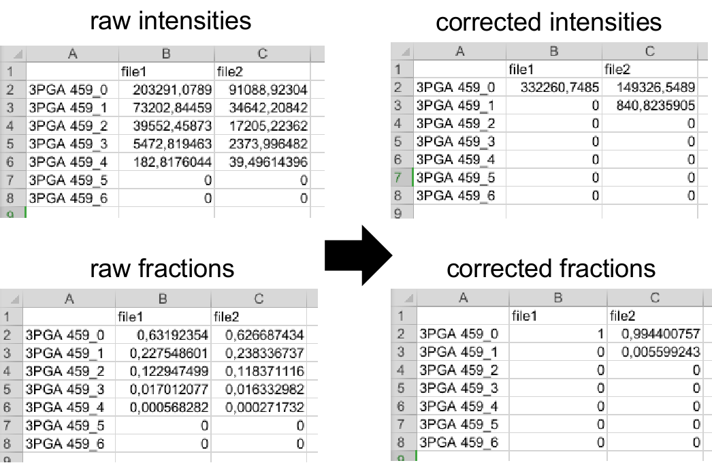

```{r, include = FALSE}
knitr::opts_chunk$set(
  collapse = TRUE,
  comment = "#>",
  fig.path = "man/figures/README-",
  out.width = "100%"
)
```

# MSinco

Mass Spectrometry Integrator and Corrector









## Installation

```{r eval=FALSE}

if (!requireNamespace("BiocManager", quietly = TRUE)) {
    install.packages("BiocManager")
}
    
    BiocManager::install("MSnbase")
    BiocManager::install("IsoCorrectoR")
    
if (!requireNamespace("devtools", quietly = TRUE)) {
    install.packages("devtools")
}
    
    devtools::install_github("mbousq/MSinco")
    
```


## Usage

```{r eval=FALSE}

library(MSinco)

run_app()


```
