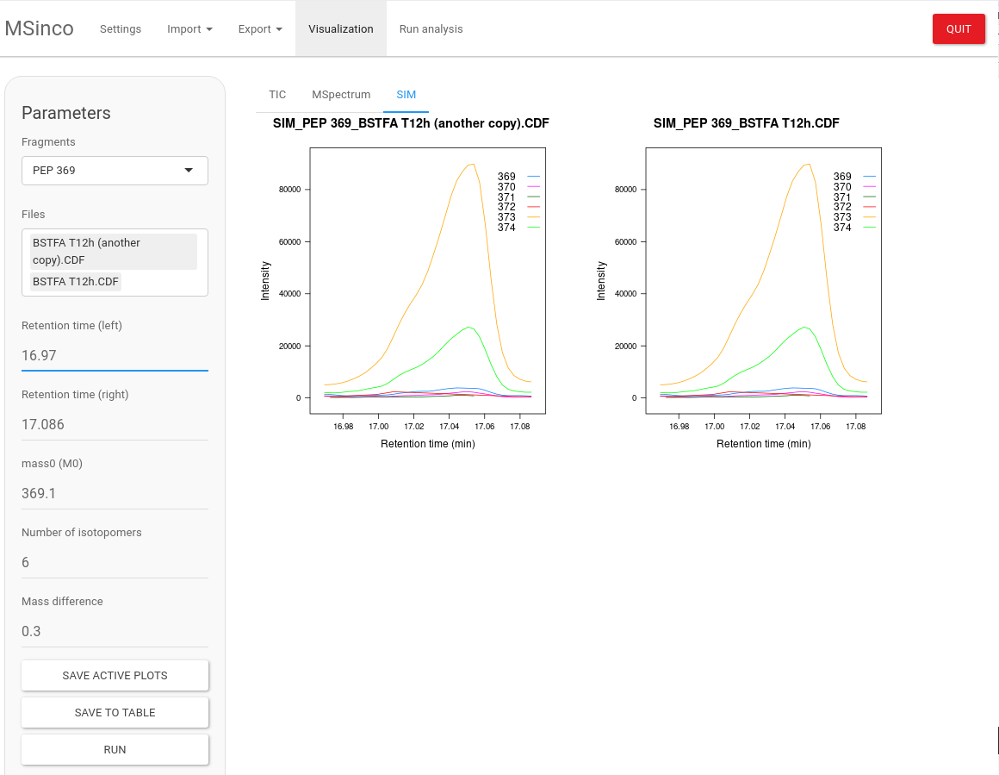
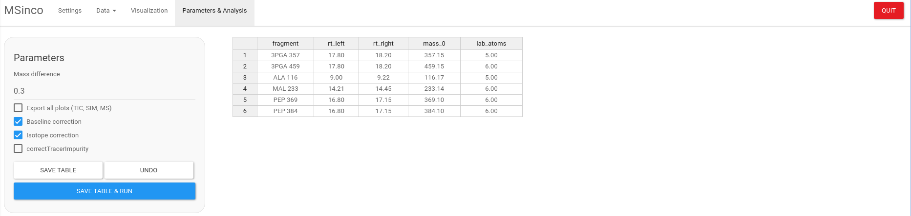

# MSinco

Mass Spectrometry Integrator and Corrector





## Installation

1- Download MSinco\_0.1.tar.gz
([Releases](https://github.com/mbousq/MSinco/releases))

2- In Rstudio, Install Package –\> Install from Package Archive File
(tar.gz)

## Usage

``` r

library(MSinco)
#> Loading required package: data.table

MSinco::run_app()
<<<<<<< HEAD

=======
#> Loading required package: shiny
#> 
#> Listening on http://127.0.0.1:6695
>>>>>>> a15b88a8e61417c0d51b4dc7cf4a62b09f1d2ea8
```
