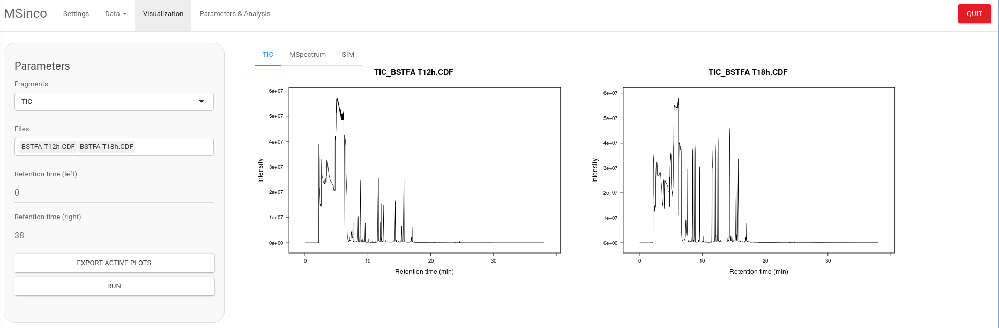

# MSinco

Mass Spectrometry Integrator and Corrector




## Installation

``` r
if (!requireNamespace("BiocManager", quietly = TRUE)) {
    install.packages("BiocManager")
}
    
    BiocManager::install("MSnbase")
    BiocManager::install("IsoCorrectoR")
    
if (!requireNamespace("devtools", quietly = TRUE)) {
    install.packages("devtools")
}
    
    devtools::install_github("mbousq/MSinco")
    
```

## Usage

``` r
library(MSinco)

run_app()
```
